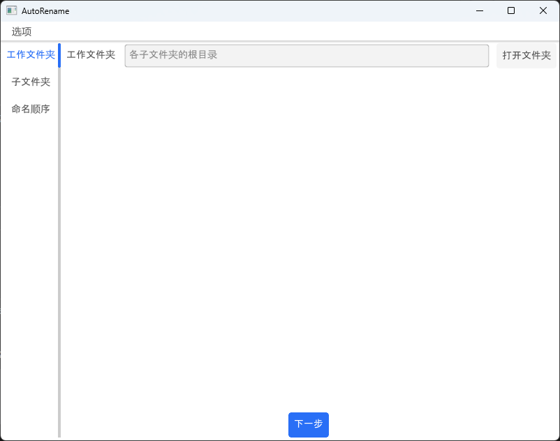
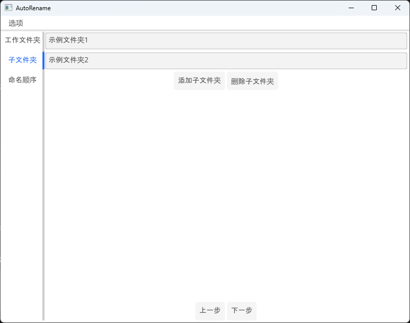
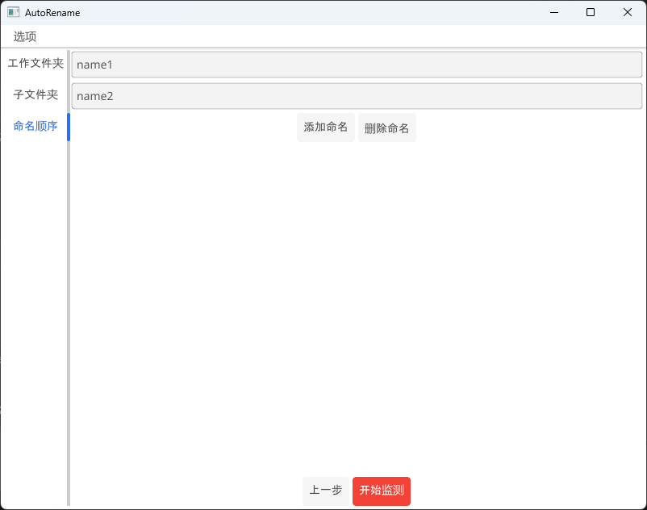
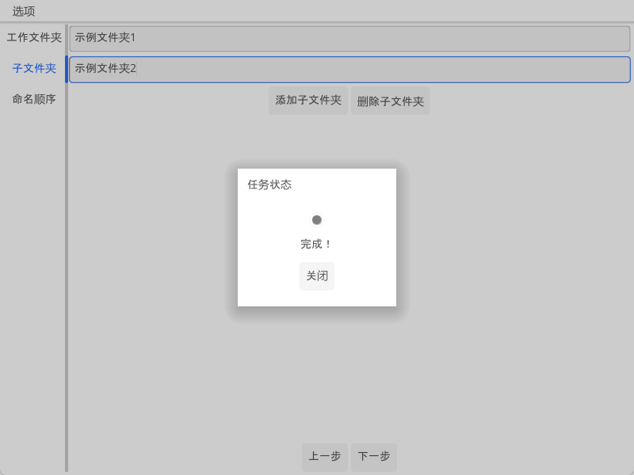

emmmmm......写这个小工具的起因是我一个朋友有一个需求，他需要将大量照片文件人工识别后按照一定规则分类，每组都有固定数量的图片文件，且有固定的重命名顺序。

于是就有了这个小工具，它很简单，就是允许你创建若干个自定义的文件夹，以及对应的重命名顺序，比如第一张图片命名为 a.jpg，第二张为 b.jpg，依此类推，它会监测这些文件夹，直至每个文件夹都被添加了指定数量的图片文件。

# 使用方法

+ 第一步，指定存放所有分组的工作文件夹。
  + **注意，此文件夹需为空，不为空的，工具后面会清空其中的所有内容！！！**

+ 第二步，设置分组名称。
  + 点击添加子文件夹按钮，并输入分组名称。
  + 这些分组名称到后面都会生成对应名称的文件夹，如台区1、台区2等等。
  + **注意，分组名称不要空着不填，空的输入框请删除！！！**不然后面无法继续运行

+ 第三步，设置重命名顺序
  + 点击添加命名按钮，依次填写重命名顺序。软件会按照从上至下的顺序对图片文件进行重命名。
    + 如图中所示，第一个添加到分组文件夹的图片会被命名为`name1.jpg`，第二个会是`name2.jpg`
  + 重命名顺序会保存到本地的`config.json`，再次打开软件时会读取并恢复，不用重复设置
  + 同样的，**不要留空**

+ 第四步，开始重命名
  + 点击开始监测按钮，然后就可以向生成的文件夹中添加图片文件了。软件会按照设置的顺序对它们自动重命名
  + 复制粘贴或者直接拖拽文件到分组文件夹都行
  + 每个分组文件夹都有指定数量的图片后，软件会显示完成，自动跳转第二步，开始下一批次的分组和重命名
    + 前一批次的文件夹自行存放到其他地方，否则会被**删除**

# 反馈问题

软件比较简陋，只实现了基本的逻辑和UI，凑合用吧，有什么 bug 可以通过[我的博客](https://www.huangoo.top)、我的邮箱（1165011707@qq.com）联系我，或者 github 的 issue 也行。

有空就修，没空就算了 : )

# 许可证

本软件采用MIT许可证，详情参见[LICENSE](LICENSE)文件。

# 鸣谢

本软件受益于以下项目和文章，非常感谢：

+ [Go](https://github.com/golang/go)
+ [Fyne](https://github.com/fyne-io/fyne)